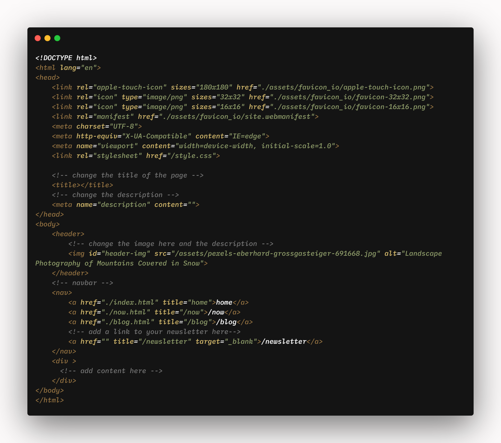

# mozturk.dev
Template of my personal website (work in progress)
==========================

Hi, this is a template I made out of my website [mozturk.dev](https://mozturk.dev/).

It's not much but you can read about it on my [blog](https://mozturk.dev/blog/how-i-built-my-website).

NOTE: I don't actually recommend using this setup as a blog, it's way too tedious to use, I'm just using this to learn how blogs work and I plan on improving this website a lot. **However, the style.css file might be useful to you if you like the look of my website.**

How to use this template
------------------------

**_I have added comments everywhere to make it easy to understand._**

To use this template simply download/clone this repo and modify or delete the homepage, /now, /blog. You can also add new ones by duplicating template.html

make sure to:
-------------

*   change the contents of "favicon\_io" (you can use [favicon.io](https://favicon.io/))
*   In the head tag, change the title and description.
*   Change the image in the header tag if you want. Images go into the assets folder.
*   Blogs go into the "blog" folder.
*   Blog related images go into "blogimgs" folder.
*   I left the rest of the files in the root folder but feel free to organize things better

### Feel free to send a pull request!
